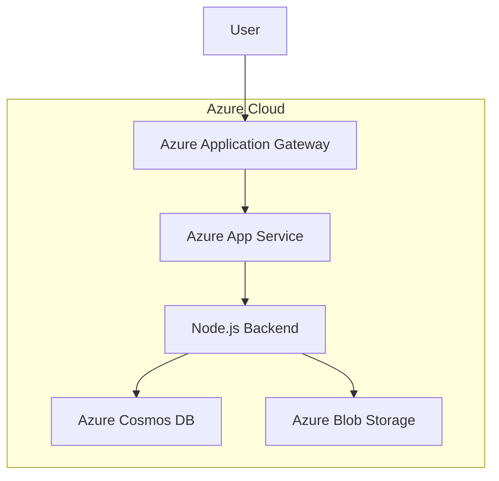

# Solar System NodeJS Application

A simple HTML+MongoDB+NodeJS project to display Solar System and it's planets.

---
## Requirements

For development, you will only need Node.js and NPM installed in your environement.

### Node
- #### Node installation on Windows

  Just go on [official Node.js website](https://nodejs.org/) and download the installer.
Also, be sure to have `git` available in your PATH, `npm` might need it (You can find git [here](https://git-scm.com/)).

- #### Node installation on Ubuntu

  You can install nodejs and npm easily with apt install, just run the following commands.

      $ sudo apt install nodejs
      $ sudo apt install npm

- #### Other Operating Systems
  You can find more information about the installation on the [official Node.js website](https://nodejs.org/) and the [official NPM website](https://npmjs.org/).

If the installation was successful, you should be able to run the following command.

    $ node --version
    v8.11.3

    $ npm --version
    6.1.0

---
## Install Dependencies from `package.json`
    $ npm install

## Run Unit Testing
    $ npm test

## Run Code Coverage
    $ npm run coverage

## Run Application
    $ npm start

## Access Application on Browser
    http://localhost:3000/


# This is the 


--------------------

```mermaid

architecture-beta
    group api(cloud)[API]

    service db(database)[Database] in api
    service disk1(disk)[Storage] in api
    service disk2(disk)[Storage] in api
    service server(server)[Server] in api

    db:L -- R:server
    disk1:T -- B:server
    disk2:T -- B:db